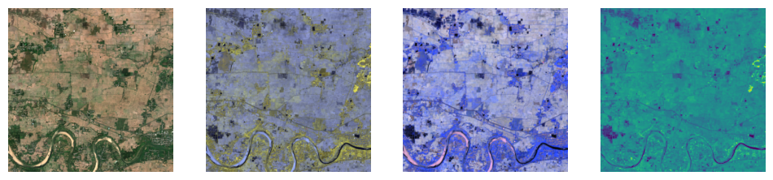

Welcome to fastgs
================

<!-- WARNING: THIS FILE WAS AUTOGENERATED! DO NOT EDIT! -->

## Introduction

**This library is currently in *alpha*, neither the functionality nor
the API is stable**

This library provides geospatial multispectral image support for fastai.
FastAI already has extensive support for RGB images in the pipeline. I
try to achieve feature parity for multi-spectral images with this
library, specifically in the context of Sentinel 2 geospatial imaging.

## Install

``` sh
pip install -Uqq fastgs
```

``` sh
conda install -c restlessronin fastgs
```

## How to use

The low-level functionality is wrapped into a class that loads sets of
Sentinel 2 channels into a multi-spectral tensor (a
[`TensorImageMS`](https://restlessronin.github.io/fastgs/vision.core.html#tensorimagems)
subclass of `fastai` `TensorImage` which itself is a subclass of the
`pytorch` `Tensor`).

``` python
from fastgs.geospatial.sentinel import *
```

If we have the following functions to map an image index to an array of
channel files

``` python
def get_input(stem: str) -> str:
    "Get full input path for stem"
    return "./images/" + stem

def tile_img_name(chn_id: str, tile_num: int) -> str:
    "File name from channel id and tile number"
    return f"Sentinel20m-{chn_id}-20200215-{tile_num:03d}.png"

def get_channel_filenames(chn_ids, tile_idx):
    "Get list of all channel filenames for one tile idx"
    return [get_input(tile_img_name(x, tile_idx)) for x in chn_ids]
```

then the following code creates a class that can load 11 Sentinel 2
channels into a
[`TensorImageMS`](https://restlessronin.github.io/fastgs/vision.core.html#tensorimagems).

``` python
from fastgs.vision.testio import * # defines read_multichan_files_as_tensor

snt_12 = Sentinel2(
    ["B02","B03","B04","B05","B06","B07","B08","B8A","B11","B12","AOT"],
    [Sentinel2.natural_color, ["B07","B06","B05"],["B12","B11","B8A"],["B08"]],
    get_channel_filenames,
    read_multichan_files
)
```

The second parameter is a list of 4 channel sets that are minimally
required to visualize all the individual channels.

``` python
img_12 = snt_12.load_tensor(66)
img_12.show()
```

    [<AxesSubplot:>, <AxesSubplot:>, <AxesSubplot:>, <AxesSubplot:>]



## Acknowledgements

This library is inspired by the following notebooks (and related works
by the authors)

- https://dpird-dma.github.io/blog/Multispectral-image-classification-Transfer-Learning/
- https://github.com/cordmaur/Fastai2-Medium/blob/master/01_Create_Datablock.ipynb
