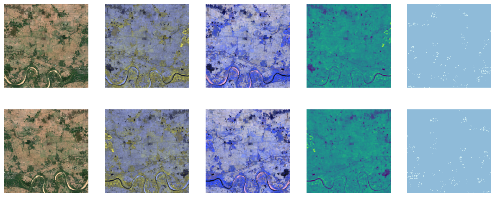
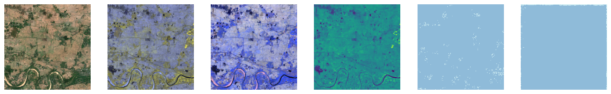

Welcome to fastgs
================

<!-- WARNING: THIS FILE WAS AUTOGENERATED! DO NOT EDIT! -->

## Introduction

**This library is currently in *alpha*, neither the functionality nor
the API is stable**. Feedback / PR’s welcome!

This library provides geospatial multi-spectral image support for
fastai. FastAI already has extensive support for RGB images in the
pipeline. I try to achieve feature parity for multi-spectral images with
this library, specifically in the context of Sentinel 2 geospatial
imaging.

## Demo Notebooks

Complete examples are provided in the following notebooks

1.  working with the kaggle [38-cloud/95-cloud landsat
    dataset](https://www.kaggle.com/code/restlessronin/cloud95-fastai-with-fastgs-multispectral-support).
2.  working on a segmentation problem with a [Sentinel 2
    dataset](https://www.kaggle.com/code/restlessronin/lila-sentinel-2-segmentation-with-fastai)

These are boths works in progress and optimized to display the features
of the library, rather than the best possible results. Even so, the
“cloud 95” notebook is providing results comparable to other hiqh
quality notebooks on the same dataset.

## Install

``` sh
pip install -Uqq fastgs
```

``` sh
conda install -c restlessronin fastgs
```

## Multi-spectral visualization

One key problem that is solved is visualization of multi-spectral data,
which has more than the three R, G, B channels.

We introduce a new category of pytorch tensor,
[`TensorImageMS`](https://restlessronin.github.io/fastgs/vision.core.html#tensorimagems),
that shows multiple images. In addition to the normal RGB image, it
handles extra channels by displaying them as additional images, either
in sets of false-colour RGB images, or as ‘monochrome’ images (one per
channel).

There is also [experimental
support](07a_vision.core.ipynb#animating-multiple-images) (not
integrated into the API yet) for mapping multi-spectral images to an
animation of multiple images. Feedback on it’s usefulness is welcome!

The first use-case is Sentinel 2 images, which are naturally “dark”.
There is a provision to provide “brightening” multipliers during
display, customizable per channel.

## Image data class

A high-level API,
[`MSData`](https://restlessronin.github.io/fastgs/multispectral.html#msdata)
is exposed that knows how to load multispectral images given some
parameters.

``` python
from fastgs.multispectral import *
```

The following code creates a class that can load 11 Sentinel 2 channels
into a
[`TensorImageMS`](https://restlessronin.github.io/fastgs/vision.core.html#tensorimagems).
The first parameter is a descriptor that provides mapping from Sentinel
2 channels to brightening factors and other parameters specific to the
inputs. This will generally be tailored to your image dataset.

``` python
from fastgs.test.io import * # defines file naming and io for our test samples

sentinel2 = createSentinel2Descriptor()

snt12_imgs = MSData.from_all(
    sentinel2,
    # B04 and B02 are transposed so that the first 3 channels are natural R,G,B channels
    ["B04","B03","B02","B05","B06","B07","B08","B8A","B11","B12","AOT"],
    [["B04","B03","B02"],["B07","B06","B05"],["B12","B11","B8A"],["B08"]],
    get_channel_filenames,
    read_multichan_files
)
```

The second parameter is a list of ids of channel to be loaded into the
image tensor, in the order in which they are loaded.

The third parameter is a list of 4 channel lists. Each channel list
describes one image that will be displayed. The lists that have 3
channel ids will map those channels to the R,G,B inputs of a
“false-colour” image. Lists with a single channel id will be mapped to
monochrome images.

In this example, we will display 4 images per MS image. The first maps
the “real” RGB channels (B04, B03, B02) of Sentinel 2 data to an RGB
image, which makes this a true-colour image. The second image maps
channels B07, B06, B05 to a false-colour image. Likewise the third image
maps B12, B11, B8A to a false-colour image. Finally the one remaining
channel B08 is mapped to a monochrome image. Thus all the channels in
the image are displayed.

The fourth parameter is a function that maps channel id’s to filenames
that provide the image data for a single channel. The final parameter is
an IO function that loads a complete TensorImageMS given the list of
files corresponding to individual channels.

## Image display

The simplest use of the high-level wrapper class is to load an indvidual
MS image.

``` python
img12 = snt12_imgs.load_image(66)
img12.show()
```

    [<AxesSubplot:>, <AxesSubplot:>, <AxesSubplot:>, <AxesSubplot:>]


Note that the single MS image is displayed as 4 images, each
corresponding to one of the channel lists we provided. The first image
is the true-colour image, the next 2 are false colour, and the final one
is monochrome.

## High level wrapper [`FastGS`](https://restlessronin.github.io/fastgs/multispectral.html#fastgs) for semantic segmentation

We also provide a high-level wrapper
[`FastGS`](https://restlessronin.github.io/fastgs/multispectral.html#fastgs)
which generates fastai dataloaders and learners for semantic
segmentation using unets. Providing support for other models and for
classification should be straightforward.

### [`MaskData`](https://restlessronin.github.io/fastgs/multispectral.html#maskdata)

Continuing our example, we provide mask information using a wrapper
class for segmentation mask loading (this is analogous to the
[`MSData`](https://restlessronin.github.io/fastgs/multispectral.html#msdata)
class, but for ‘normal’ `TensorImage`s).

``` python
msks = MaskData("LC",get_channel_filenames,read_mask_file,["non-building","building"])
```

### [`MSAugment`](https://restlessronin.github.io/fastgs/multispectral.html#msaugment)

We also provide a wrapper class that can specify which (if any)
augmentations to use during training and validation, using the
albumentations library (which works for multi-spectral data).

``` python
import albumentations as A
```

Here we just use demo augmentations

``` python
augs = MSAugment(train_aug=A.Rotate(p=1),valid_aug=A.HorizontalFlip(p=0.33))
```

Now we create the actual high level wrapper

``` python
fastgs = FastGS(snt12_imgs,msks,augs)
```

Create a datablock and a data loader

``` python
db = fastgs.create_data_block()
dl = db.dataloaders(source=[66]*10,bs=8) # repeat the sample image 10 times
```

Now we can see the visualization support in action. Let’s look at some
training and validation batches (with augmentation). Each row shows the
image in 4 columns and the mask in the 5th.

``` python
from fastai.vision.all import *
from fastgs.vision.data import *
from fastgs.vision.learner import *
from fastgs.vision.augment import *
```

``` python
dl.train.show_batch(max_n=3,mskovl=False) # don't overlay mask
```


``` python
dl.valid.show_batch(mskovl=False)
```



We create and train a unet learner and look at results. Image is in
first 4 columns, mask in the 5th and prediction in the 6th.

``` python
learner = fastgs.create_unet_learner(dl, resnet18,reweight="avg") # weights of n > 3 channels are set to average of first 3 channels
learner.fit_one_cycle(1)
learner.show_results(mskovl=False)
```

<table border="1" class="dataframe">
  <thead>
    <tr style="text-align: left;">
      <th>epoch</th>
      <th>train_loss</th>
      <th>valid_loss</th>
      <th>dice</th>
      <th>time</th>
    </tr>
  </thead>
  <tbody>
    <tr>
      <td>0</td>
      <td>0.858259</td>
      <td>0.631103</td>
      <td>0.036843</td>
      <td>00:25</td>
    </tr>
  </tbody>
</table>


Finally, we can look at the top losses

``` python
interp = SegmentationInterpretation.from_learner(learner)
interp.plot_top_losses(k=1,mskovl=False)
```



## Acknowledgements

This library is inspired by the following notebooks (and related works
by the authors)

- [@cordmaur](https://github.com/cordmaur) - Mauricio Cordeiro’s
  [multi-spectral segmentation fastai
  pipeline](https://www.kaggle.com/code/cordmaur/remotesensing-fastai2-multiband-augmentations/notebook)
- [@wrignj08](https://github.com/wrignj08) - Nick Wright’s
  [multi-spectral classification
  notebook](https://dpird-dma.github.io/blog/Multispectral-image-classification-Transfer-Learning//)
